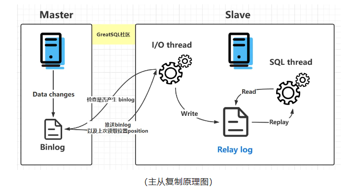

### `Percona XtraDB Cluster`

#### 端口说明

- Port 3306 is the default port for MySQL. This port facilitates communication and data transfer between nodes and applications.
- Port 4567 is used for Galera replication traffic, which is vital for synchronizing data across the cluster nodes.
- Port 4568 is used for Incremental State Transfer (IST), allowing nodes to transfer only the missing blocks of data.
- Port 4444 is for State Snapshot Transfer (SST), which involves a complete data snapshot transfer from one node to another.
- Port 9200 if you use Percona Monitoring and Management (PMM) for cluster monitoring.
- Port 33060 is the default port for MySQLX protocol. This port is used for communication between MySQL clients and the MySQL server using the MySQLX protocol.

#### 预处理

```shell
# 检查时间/时区
timedatectl

# 磁盘 CPU 内存 操作系统版本 IP

# SELinux
setenforce 0
sed -i 's/\(^SELINUX=\).*/\SELINUX=disabled/' /etc/selinux/config

# 关防火墙
systemctl stop firewalld.service
systemctl disable firewalld.service

# wget
yum install -y https://mirrors.aliyun.com/centos/7.9.2009/os/x86_64/Packages/wget-1.14-18.el7_6.1.x86_64.rpm

# 更换yum源
cd /etc
mv yum.repos.d yum.repos.d.bak
mkdir yum.repos.d
wget -O /etc/yum.repos.d/CentOS-Base.repo http://mirrors.aliyun.com/repo/Centos-7.repo 


sed -i 's/\$releasever/7/g' /etc/yum.repos.d/CentOS-Base.repo

yum clean all
yum makecache
```

#### 下载安装包

```shell
mkdir -p /tools/rpm/{pxc,client,toolkit,sysbench,proxysql,haproxy}
yum install -y https://repo.percona.com/yum/percona-release-latest.noarch.rpm
percona-release enable pdpxc-8.0.34 release  # 指定版本，加release说明是稳定版本
percona-release enable sysbench release
percona-release enable proxysql release
percona-release show

yum install --downloadonly --downloaddir=/tools/rpm/pxc percona-xtradb-cluster
yum install --downloadonly --downloaddir=/tools/rpm/client percona-xtradb-cluster-client
yum install --downloadonly --downloaddir=/tools/rpm/toolkit percona-toolkit
yum install --downloadonly --downloaddir=/tools/rpm/sysbench sysbench
yum install --downloadonly --downloaddir=/tools/rpm/proxysql proxysql2
yum install --downloadonly --downloaddir=/tools/rpm/xtrabackup percona-xtrabackup-80
yum install --downloadonly --downloaddir=/tools/rpm/haproxy percona-haproxy

```

#### 安装`Percona XtraDB Cluster`

```shell
# 卸载mariadb
yum remove -y mariadb*
rpm -qa | grep mariadb

# 启用nobody用户


# 安装Percona XtraDB Cluster
yum localinstall -y /tools/rpm/pxc/*.rpm

# pt需要的函数
#Percona XtraDB Cluster is distributed with several useful UDFs from Percona Toolkit.
#Run the following commands to create these functions:
#mysql -e "CREATE FUNCTION fnv1a_64 RETURNS INTEGER SONAME 'libfnv1a_udf.so'"
#mysql -e "CREATE FUNCTION fnv_64 RETURNS INTEGER SONAME 'libfnv_udf.so'"
#mysql -e "CREATE FUNCTION murmur_hash RETURNS INTEGER SONAME 'libmurmur_udf.so'"
#See  http://www.percona.com/doc/percona-server/8.0/management/udf_percona_toolkit.html for more details

# 更改临时密码
systemctl start mysql
grep temp /var/log/mysqld.log
ALTER USER 'root'@'localhost' IDENTIFIED BY 'welcome';
systemctl stop mysql

# 修改 /usr/lib/systemd/system/mysql.service
LimitNOFILE=1000000         # 增加最大文件句柄数
OOMScoreAdjust=-500         # 调整mysql的oom_score_adj值，防止mysql被kill掉

systemctl daemon-reload

# 查看进程号
pgrep mysqld
# 查看LimitNOFILE
cat /proc/2978/limits
# 查看OOMScoreAdjust
cat /proc/2978/oom_score_adj
# 查看线程数
cat /proc/2978/status | grep -i threds
ps -T 2978 | wc -l
```

#### 更改参数，启动`pxc`

```shell
# 修改配置文件 /etc/my.cnf
[mysql]
port=38809
socket=/data/mysql/mysql.sock

[mysqld]
# === Required Settings ===
server-id=1
bind_address=0.0.0.0
port=38809
datadir=/data/mysql
tmpdir=/data/ics_tmp
socket=/data/mysql/mysql.sock
pid_file=/var/run/mysqld/mysqld.pid
skip_external_locking=on   # 是否跳过外部锁定(文件系统)
skip_name_resolve=on       # 是否使用主机名解析
local_infile=off

# max_allowed_packet = 128M
max_connect_errors=10000     # flush hosts after 10000 failed attempts
# secure-log-path=/var/log/mysql

# === SQL Compatibility Mode ===
#sql_mode=ONLY_FULL_GROUP_BY,STRICT_TRANS_TABLES,NO_ZERO_IN_DATE,NO_ZERO_DATE,ERROR_FOR_DIVISION_BY_ZERO,NO_ENGINE_SUBSTITUTION
sql_mode=STRICT_TRANS_TABLES,NO_ZERO_IN_DATE,NO_ZERO_DATE,ERROR_FOR_DIVISION_BY_ZERO
group_concat_max_len=102400

# === InnoDB Settings ===
default_storage_engine=InnoDB
innodb_buffer_pool_instances=4     # 减少锁竞争，Use 1 instance per 1GB of InnoDB pool size - max is 64
innodb_buffer_pool_size=10G        # 存储引擎的缓存大小，Use up to 70-80% of RAM
innodb_file_per_table=on
innodb_flush_log_at_trx_commit=0     # 0: 每秒写入磁盘, 1: 事务提交，重做日志写入磁盘，2: 事务提交，写入内存，每秒刷新到磁盘
# innodb_flush_method             = O_DIRECT
innodb_log_buffer_size=16M         # Innodb_log_waits 的值较高，可能需要增加日志缓冲区大小
innodb_log_file_size=1G            # 弃用，innodb_redo_log_capacity=2147483648
innodb_log_files_in_group=4        # 日志文件数量
innodb_sort_buffer_size=4M         # UPD - Defines how much data is read into memory for sorting operations before writing to disk (default is 1M / max is 64M)
innodb_stats_on_metadata=off       # 表结构变更时是否自动更新表的统计信息
innodb_read_io_threads=16
innodb_write_io_threads=16
innodb_fast_shutdown=0
#innodb_io_capacity=2000           # Depends on the storage tech - use 2000 for SSD, more for NVMe
#innodb_io_capacity_max=4000       # Usually double the value of innodb_io_capacity

# === Connection Settings ===
max_connections=1000

# === Buffer Settings ===
join_buffer_size=4M                  # 1G
read_buffer_size=3M
read_rnd_buffer_size=4M
sort_buffer_size=4M                  # 1G

# === Table Settings ===
table_definition_cache=40000
table_open_cache=40000
open_files_limit=400000

max_heap_table_size=128M # 内存中用户临时表的最大大小
tmp_table_size=128M      # 内存中内部临时表的最大大小


# === Error & Slow Query Logging ===
log_timestamps=SYSTEM     # 日志时间戳格式
log_error=/data/mysql/log/mysqld.log
log_queries_not_using_indexes=on             # Disabled on production
long_query_time=10
slow_query_log=on                            # Disabled on production
slow_query_log_file=/data/mysql/log/slow.log     # logrouter
log_error_suppression_list=MY-013360

# In order for Galera to work correctly binlog format should be ROW
binlog_format=ROW
log-bin=/data/mysql/binlog/binlog
# Binary log expiration period is 604800 seconds, which equals 7 days
binlog_expire_logs_seconds=604800                 # binlog日志过期时间, expire_logs_days = 7

# Slave thread to use
wsrep_applier_threads=8                       # 原来是 wsrep_slave_threads
wsrep_log_conflicts=on                        # 记录冲突日志
# This changes how InnoDB autoincrement locks are managed and is a requirement for Galera
innodb_autoinc_lock_mode=2


# === wsrep Settings ===
# Path to Galera library
wsrep_provider=/usr/lib64/galera4/libgalera_smm.so
# Cluster connection URL contains IPs of nodes
#If no IP is found, this implies that a new cluster needs to be created,
#in order to do that you need to bootstrap this node
wsrep_cluster_name=pxc-cluster
wsrep_cluster_address=gcomm://10.50.138.233:24567,10.50.138.234:24567,10.50.138.235:24567
wsrep_node_name=pxc-cluster-node-1
wsrep_node_address=10.50.138.233
#pxc_strict_mode allowed values: DISABLED,PERMISSIVE,ENFORCING,MASTER
#pxc_strict_mode=ENFORCING
pxc_strict_mode=DISABLED
# SST method
wsrep_sst_method=xtrabackup-v2
# SST auth credentials
pxc-encrypt-cluster-traffic=OFF
wsrep_causal_reads=on


# === pxc port settings ===
# 4567 -> 14567, 4568 -> 14568
wsrep_provider_options="gmcast.listen_addr=tcp://0.0.0.0:24567;ist.recv_addr=10.50.138.233:24568;"

# 4444 -> 14444
wsrep_sst_receive_address=10.50.138.233:24444


# === timeout ===
wait_timeout=300
net_read_timeout=300
net_write_timeout=300
interactive_timeout=300
innodb_lock_wait_timeout=50
mysqlx_wait_timeout=300        # MYSQLX协议等待超时


#####
#innodb_flush_method=O_DIRECT


# 引导第一个节点
systemctl start mysql@bootstrap.service
```

#### `mysql`中修改参数

```mysql
-- 只修改选项值，重启后生效 (mysqld-auto.cnf)
SET PERSIST_ONLY innodb_buffer_pool_size = 4294967296;

-- 都修改
SET PERSIST innodb_buffer_pool_size = 4294967296;

```

#### 检查`Percona XtraDB Cluster`

```mysql
-- wsrep_cluster_size: 集群节点数
-- wsrep_cluster_status: 集群状态
-- wsrep_connected: 集群连接状态
-- wsrep_ready: 集群是否准备好
-- wsrep_last_committed: 最后提交的事务ID
-- wsrep_local_cached_downto: 当前gcache中缓存的最小事务ID
show status where Variable_name in ('wsrep_cluster_size',
                                    'wsrep_cluster_status',
                                    'wsrep_connected',
                                    'wsrep_ready',
                                    'wsrep_last_committed',
                                    'wsrep_local_cached_downto');


-- 如果有多个SYNCED状态的节点，joiner会优先选择有相同gmcast.segment值
select *
  from performance_schema.pxc_cluster_view;

```

#### `pxc`中的重要知识点

##### `grastate.dat`

- `seqno`: 正常关闭时，其`seqno`值会被保存到`grastate.dat`文件中，以便在重启时使用。开户状态或者异常关闭时，`seqno`值为`-1`。
- `safe_to_bootstrap`: 哪一个节点最后一个离开集群。最后一个值为`1`，否则为`0`。如果都异常关闭，要手机修改一台节点为`1`，存在丢失数据的风险。 

```shell
# 异常关闭时，取得seqno值
[root@mysql-01 mysql]# kill -9 30530
[root@mysql-01 mysql]# cat grastate.dat
# GALERA saved state
version: 2.1
uuid:    6f413512-7660-11ef-9bc2-07fa6338f0fa
seqno:   -1
safe_to_bootstrap: 0
     [root@mysql-01 mysql]# systemctl status mysql
● mysql.service - Percona XtraDB Cluster
   Loaded: loaded (/usr/lib/systemd/system/mysql.service; enabled; vendor preset: disabled)
   Active: failed (Result: exit-code) since Mon 2024-09-23 18:10:05 CST; 17s ago
  Process: 31374 ExecStopPost=/usr/bin/mysql-systemd stop-post (code=exited, status=3)
  Process: 28804 ExecStop=/usr/bin/mysql-systemd stop (code=exited, status=0/SUCCESS)
  Process: 31192 ExecStartPost=/usr/bin/mysql-systemd start-post $MAINPID (code=exited, status=0/SUCCESS)
  Process: 31190 ExecStartPost=/bin/sh -c systemctl unset-environment _WSREP_START_POSITION (code=exited, status=0/SUCCESS)
  Process: 30530 ExecStart=/usr/sbin/mysqld $_WSREP_START_POSITION (code=killed, signal=KILL)
  Process: 30478 ExecStartPre=/bin/sh -c VAR=`bash /usr/bin/mysql-systemd galera-recovery`; [ $? -eq 0 ] && systemctl set-environment _WSREP_START_POSITION=$VAR || exit 1 (code=exited, status=0/SUCCESS)
  Process: 30476 ExecStartPre=/bin/sh -c systemctl unset-environment _WSREP_START_POSITION (code=exited, status=0/SUCCESS)
  Process: 30433 ExecStartPre=/usr/bin/mysql-systemd start-pre (code=exited, status=0/SUCCESS)
 Main PID: 30530 (code=killed, signal=KILL)
   Status: "Server is operational"

# https://galeracluster.com/library/training/tutorials/restarting-cluster.html
# 直接启动节点
systemctl start mysql

Log of wsrep recovery (--wsrep-recover):
 INFO: WSREP: Running position recovery with --log_error='/data/mysql/wsrep_recovery_verbose.OY5IFO' --pid-file='/data/mysql/mysql-01-recover.pid'
 INFO: WSREP: Recovered position 6f413512-7660-11ef-9bc2-07fa6338f0fa:4149363
 
# 手动的取得seqno值
# 从innodb表空间的状态中取得seqno值
[root@mysql-01 mysql]# mysqld_safe --wsrep-recover
2024-09-23T10:18:36.084178Z mysqld_safe Logging to '/data/mysql/log/mysqld.log'.
2024-09-23T10:18:36.087235Z mysqld_safe Logging to '/data/mysql/log/mysqld.log'.
2024-09-23T10:18:36.150919Z mysqld_safe Starting mysqld daemon with databases from /data/mysql
2024-09-23T10:18:36.165499Z mysqld_safe WSREP: Running position recovery with --log_error='/data/mysql/wsrep_recovery.mgtwzI' --pid-file='/data/mysql/-recover.pid'
2024-09-23T10:18:39.555801Z mysqld_safe WSREP: Recovered position 6f413512-7660-11ef-9bc2-07fa6338f0fa:4149365
2024-09-23T10:18:43.104080Z mysqld_safe mysqld from pid file /var/run/mysqld/mysqld.pid ended
```

#### `wsrep_local_cached_downto`

> 该值表示当前节点的`gcache`中缓存的最小事务ID。

```text
-- 正常节点的 wsrep_local_cached_downto > 待恢复结点的 grastate.dat 的 seqno  (发送者最小的事务id都比接收者的事务id大，没办法增量了) 
-- 异常关闭的节点的 grastate.dat 的 seqno = -1，做 recovery，或者启动的时候自己会从innodb表空间的状态中取得seqno值。


-- wsrep_local_cached_downto: 最小能同步的事务ID(被同步节点)
-- wsrep_last_committed: 同步的最后一个事务ID(被同步节点)
-- grastate.dat 的 seqno : 当前的事务ID(同步节点)
-- wsrep_last_committed - wsrep_local_cached_downto = 能名同步的最大事务数量
-- wsrep_last_committed - grastate.dat 的 seqno = 需要同步的事务数量

-- 正常节点
mysql> show global status like 'wsrep_local_cached_downto';
+---------------------------+----------+
| Variable_name             | Value    |
+---------------------------+----------+
| wsrep_local_cached_downto | 12872206 |
+---------------------------+----------+
1 row in set (0.00 sec)

mysql> show global status like 'wsrep_last_committed';
+----------------------+----------+
| Variable_name        | Value    |
+----------------------+----------+
| wsrep_last_committed | 12880272 |
+----------------------+----------+
1 row in set (0.00 sec)
             
-- 关闭的节点
[root@mysql-02 mysql]# cat grastate.dat
# GALERA saved state
version: 2.1
uuid:    6f413512-7660-11ef-9bc2-07fa6338f0fa
seqno:   12880268
safe_to_bootstrap: 0
             
12872206 < 12880268  ------>>> 可以走IST

2024-09-27T18:09:52.916033+08:00 1 [Note] [MY-000000] [Galera] State transfer required:
        Group state: 6f413512-7660-11ef-9bc2-07fa6338f0fa:12880272
        Local state: 6f413512-7660-11ef-9bc2-07fa6338f0fa:12880268
        
2024-09-27T18:09:53.698046+08:00 1 [Note] [MY-000000] [Galera] ####### IST uuid:6f413512-7660-11ef-9bc2-07fa6338f0fa f: 12880269, l: 12880272, STRv: 3
2024-09-27T18:09:53.698335+08:00 1 [Note] [MY-000000] [Galera] IST receiver addr using tcp://192.168.1.46:24568
2024-09-27T18:09:53.698781+08:00 1 [Note] [MY-000000] [Galera] Prepared IST receiver for 12880269-12880272, listening at: tcp://192.168.1.46:24568
2024-09-27T18:09:53.831937+08:00 0 [Note] [MY-000000] [Galera] Member 1.0 (pxc-cluster-node-2) requested state transfer from '*any*'. Selected 0.0 (pxc-cluster-node-1)(SYNCED) as donor.
2024-09-27T18:09:53.832027+08:00 0 [Note] [MY-000000] [Galera] Shifting PRIMARY -> JOINER (TO: 12880272)
2024-09-27T18:09:53.832184+08:00 1 [Note] [MY-000000] [Galera] Requesting state transfer: success, donor: 0
2024-09-27T18:09:55.302933+08:00 0 [Note] [MY-000000] [WSREP-SST] xtrabackup_ist received from donor: Running IST
2024-09-27T18:09:55.303016+08:00 0 [Note] [MY-000000] [WSREP-SST] Running post-processing...........
2024-09-27T18:09:55.307358+08:00 0 [Note] [MY-000000] [WSREP-SST] Skipping mysql_upgrade (ist)
2024-09-27T18:09:55.307391+08:00 0 [Note] [MY-000000] [WSREP-SST] ...........post-processing done
2024-09-27T18:09:55.308706+08:00 0 [Note] [MY-000000] [WSREP-SST] Galera co-ords from recovery: 6f413512-7660-11ef-9bc2-07fa6338f0fa:12880268 

```

#### `gcache.page_size`和`gcache.size`

> 这二个参数对于恢复来说至关重要，如果需要恢复的事务都在这二个文件里，那么会走`IST`，否则会走`SST`。

- 设置方法: `wsrep_provider_options="gcache.page_size=4M;gcache.size=4M"`
- gcache.page_size: 对应文件 `galera.cache`
- gcache.size: 对应内存 `galera.cache`
- 当在做`SST`时，`gcache.page`会保留多个，因为在做`SST`时，源库要保留增量。
- 正常情况下，gcache.page会在创建新文件时，会自动删除旧文件，所以不会占用过多的空间。

#### 卸载`Percona XtraDB Cluster`
```shell
yum remove -y percona-xtradb-cluster*
rm -f /var/log/mysql*.log
userdel -r mysql
groupdel mysql
find / -name mysql

#
yum install -y policycoreutils-python.x86_64
semanage port -l | grep mysql
# 默认
# [root@mysql-02 ~]# semanage port -l | grep mysql
# mysqld_port_t                  tcp      1186, 3306, 63132-63164
# mysqlmanagerd_port_t           tcp      2273
# 删除安装的4568端口
semanage port -d -t mysqld_port_t -p tcp 4568
```

#### 忘记密码

```text
[mysqld]
skip-grant-tables

flush privileges;
alter user 'root'@'localhost' identified by 'welcome';
flush privileges;
```

#### `mysql`中的日志



- `binlog` : 二进制日志，记录所有对数据库的修改操作，主要用于数据库复制和数据恢复。
- `error` : 错误日志，记录数据库运行过程中的错误信息。
- `general` : 通用日志，记录连接建立和执行的SQL语句。
- `slow_query` : 慢查询日志，记录执行时间超过`long_query_time`的SQL语句。
- `relay log` : 中继日志，为主从同步服务，只存在于从服务器上，
- `redo log` : 记录数据变更后的信息，主要用于数据恢复。
- `undo log` ： 记录数据变更前的信息，主要用于事务回滚，同时也用于多版本并发控制。

### 高可用

> https://severalnines.com/resources/whitepapers/mysql-load-balancing-with-haproxy/
> https://docs.percona.com/percona-xtradb-cluster/5.7/howtos/virt_sandbox.html


#### 配置`clustercheck`

```mysql
CREATE USER 'clustercheckuser'@'localhost' IDENTIFIED BY 'welcome';
GRANT PROCESS ON *.* TO 'clustercheckuser'@'localhost';
FLUSH PRIVILEGES;
```

```shell
# 修改脚本用户名密码
egrep '1-clustercheckuser|2-clustercheckpassword!' /usr/bin/clustercheck
sed -i 's/1-clustercheckuser/1-clustercheckuser/g' /usr/bin/clustercheck
sed -i 's/2-clustercheckpassword!/2-welcome/g' /usr/bin/clustercheck

egrep '^MYSQL_USERNAME|^MYSQL_PASSWORD' /usr/bin/clustercheck

/usr/bin/clustercheck
```

#### 安装与配置`xinetd`

```shell
# 安装xinetd
yum -y install xinetd

# 配置xinetd
# /etc/xinetd.d/mysqlchk

# default: on
# description: mysqlchk
service mysqlchk
{
    # this is a config for xinetd, place it in /etc/xinetd.d/
    disable = no
    flags = REUSE
    socket_type = stream
    port = 9200
    wait = no
    # user = nobody
    user = root
    server = /usr/bin/clustercheck
    log_on_failure += USERID
    only_from = 0.0.0.0/0
    # recommended to put the IPs that need
    # to connect exclusively (security purposes)
    per_source = UNLIMITED
}


# /etc/services
echo -e "mysqlchk\t9200/tcp\t\t# mysqlchk" >> /etc/services

# 启动xinetd
systemctl enable xinetd
systemctl start xinetd

# 测试
curl -i http://127.0.0.1:9200

```

#### 配置`haproxy`

##### 负载均衡算法

- `roundrobin`：轮询
- `static-rr`：静态轮询，类似于`roundrobin`，权重是静态的，不会动态调整。
- `leastconn`：最少连接数
- `first`：第一个可用，达到最大连接数时，才会选择下一个。
- `source`：根据源地址`hash`
- `uri`：根据请求`uri`进行`hash`
- `url_param`：根据请求`url`参数

##### 安装与配置`haproxy`

```shell
# 安装
yum localinstall -y /tools/rpm/haproxy/*.rpm

# 配置文件
vim /etc/haproxy/haproxy.cfg


#---------------------------------------------------------------------
# Example configuration for a possible web application.  See the
# full configuration options online.
#
#   https://www.haproxy.org/download/1.8/doc/configuration.txt
#
#---------------------------------------------------------------------

#---------------------------------------------------------------------
# Global settings
#---------------------------------------------------------------------
global
    # to have these messages end up in /var/log/haproxy.log you will
    # need to:
    #
    # 1) configure syslog to accept network log events.  This is done
    #    by adding the '-r' option to the SYSLOGD_OPTIONS in
    #    /etc/sysconfig/syslog
    #
    # 2) configure local2 events to go to the /var/log/haproxy.log
    #   file. A line like the following can be added to
    #   /etc/sysconfig/syslog
    #
    #    local2.*                       /var/log/haproxy.log
    #
    log         127.0.0.1 local2

    chroot      /var/lib/haproxy
    pidfile     /var/run/haproxy.pid
    maxconn     4000
    user        haproxy
    group       haproxy
    daemon

    # turn on stats unix socket
    stats socket /var/lib/haproxy/stats mode 600 level admin

    # utilize system-wide crypto-policies
    ssl-default-bind-ciphers PROFILE=SYSTEM
    ssl-default-server-ciphers PROFILE=SYSTEM

#---------------------------------------------------------------------
# common defaults that all the 'listen' and 'backend' sections will
# use if not designated in their block
#---------------------------------------------------------------------
defaults
    mode                    http
    log                     global
    option                  httplog
    option                  dontlognull
    option http-server-close
    option forwardfor       except 127.0.0.0/8
    option                  redispatch
    retries                 3
    timeout http-request    10s
    timeout queue           1m
    timeout connect         10s
    timeout client          1m
    timeout server          1m
    timeout http-keep-alive 10s
    timeout check           10s
    maxconn                 3000


#---------------------------------------------------------------------
# stats
#---------------------------------------------------------------------
frontend stats-front
    bind *:80
    mode http
    default_backend stats-back

backend stats-back
    mode http
    balance roundrobin
    stats uri /stats
    stats auth admin:welcome


#---------------------------------------------------------------------
# pxc
#---------------------------------------------------------------------
frontend pxc-front
    bind *:3307
    mode tcp
    default_backend pxc-back

backend pxc-back
    mode tcp
    balance leastconn
    option httpchk
    server c1 192.168.1.45:38809 check port 9200 inter 12000 rise 3 fall 3
    server c2 192.168.1.46:38809 check port 9200 inter 12000 rise 3 fall 3
    server c3 192.168.1.47:38809 check port 9200 inter 12000 rise 3 fall 3


#
systemctl restart haproxy
systemctl enable haproxy

http://192.168.1.45/stats
```

##### 命令行操作`haproxy`

```shell
stats socket /var/lib/haproxy/stats mode 600 level admin

# /var/lib/haproxy/stats  统计信息套接字的路径
# mode 600  套接字权限
# level admin  权限级别，admin级别允许执行所有管理操作，包括查看统计信息，修改配置等。

# 查看统计信息
echo "show info" | socat stdio /var/lib/haproxy/stats

# 查看运行状态
echo "show stat" | socat stdio /var/lib/haproxy/stats

# 查看内存使用情况
echo "show pools" | socat stdio /var/lib/haproxy/stats

# report last request and response errors for each proxy
echo "show errors" | socat stdio /var/lib/haproxy/stats

# 下线节点
echo "disable server pxc-back/c1" | socat stdio /var/lib/haproxy/stats

# 上线节点
echo "enable server pxc-back/c1" | socat stdio /var/lib/haproxy/stats

```

##### 测试

```shell
# 查看状态
[root@mysql-01 ~]# echo "show stat" | socat stdio /var/lib/haproxy/stats| grep c1
pxc-back,c1,0,0,0,0,,0,0,0,,0,,0,0,0,0,UP,1,1,0,0,1,83416,36,,1,5,1,,0,,2,0,,0,L7OK,200,81,,,,,,,,,,,0,0,,,,,-1,,,0,0,0,0,,,,Layer7 check passed,,3,3,5,,,,192.168.1.45:38809,,tcp,,,,,,,,0,0,0,,,0,,0,0,0,0,0,0,0,0,1,1,,,,0,,,,,,,,,,-,0,0,0,,,,,,,,,,,,,,,,,,,,,,

# 模拟`wsrep_ready`为`OFF`状态
[root@mysql-01 ~]# iptables -A INPUT -p tcp --dport 24567 -j DROP
[root@mysql-01 ~]# iptables -A OUTPUT -p tcp --dport 24567 -j DROP
[root@mysql-01 ~]# curl http://127.0.0.1:9200
Percona XtraDB Cluster Node is not synced or non-PRIM.

[root@mysql-01 ~]# echo "show stat" | socat stdio /var/lib/haproxy/stats| grep c1
pxc-back,c1,0,0,0,0,,0,0,0,,0,,0,0,0,0,DOWN,1,1,0,3,2,29,65,,1,5,1,,0,,2,0,,0,L7STS,503,58,,,,,,,,,,,0,0,,,,,-1,Service Unavailable,,0,0,0,0,,,,Layer7 wrong status,,3,3,0,,,,192.168.1.45:38809,,tcp,,,,,,,,0,0,0,,,0,,0,0,0,0,0,0,0,0,1,1,,,,0,,,,,,,,,,-,0,0,0,,,,,,,,,,,,,,,,,,,,,,

[root@mysql-01 ~]# ss -antpl | grep 38809
LISTEN     0      128          *:38809                    *:*                   users:(("mysqld",pid=24972,fd=59))

[root@mysql-01 log]# iptables -F
[root@mysql-01 ~]# curl http://127.0.0.1:9200
Percona XtraDB Cluster Node is synced.
[root@mysql-01 ~]# echo "show stat" | socat stdio /var/lib/haproxy/stats| grep c1
pxc-back,c1,0,0,0,0,,0,0,0,,0,,0,0,0,0,UP,1,1,0,3,2,18,205,,1,5,1,,0,,2,0,,0,L7OK,200,59,,,,,,,,,,,0,0,,,,,-1,,,0,0,0,0,,,,Layer7 check passed,,3,3,5,,,,192.168.1.45:38809,,tcp,,,,,,,,0,0,0,,,0,,0,0,0,0,0,0,0,0,1,1,,,,0,,,,,,,,,,-,0,0,0,,,,,,,,,,,,,,,,,,,,,,
```

#### 安装与配置`keepalived`

```shell
yum install keepalived -y

/etc/keepalived/keepalived.conf

global_defs {
}

vrrp_script chk_haproxy {
    script "killall -0 haproxy" # widely used idiom
    interval 2 # check every 2 seconds
    weight 2 # add 2 points of prio if OK
}

vrrp_instance VI_PXC {
    interface ens192
    state MASTER
    priority 101
    virtual_router_id 51
    authentication {
        auth_type PASS
        auth_pass Kls45f3d
    }
    virtual_ipaddress {
        192.168.1.44/24
    }
    unicast_src_ip 192.168.1.45  # This node
    unicast_peer {
        192.168.1.46                 # Other nodes
        192.168.1.47                 # Other nodes
    }
    track_script {
        chk_haproxy
    }
}


global_defs {
}

vrrp_script chk_haproxy {
    script "killall -0 haproxy" # widely used idiom
    interval 2 # check every 2 seconds
    weight 2 # add 2 points of prio if OK
}

vrrp_instance VI_PXC {
    interface ens192
    state BACKUP
    priority 99
    virtual_router_id 51
    authentication {
        auth_type PASS
        auth_pass Kls45f3d
    }
    virtual_ipaddress {
        192.168.1.44/24
    }
    unicast_src_ip 192.168.1.47  # This node
    unicast_peer {
        192.168.1.45                 # Other nodes
        192.168.1.46                 # Other nodes
    }
    track_script {
        chk_haproxy
    }
}

systemctl enable keepalived
systemctl start keepalived
```

### `sysbench`

#### 创建用户

```mysql
show plugins;
-- create user 'sbuser'@'192.168.%.%' identified by'sbpass';
create user 'sbuser'@'192.168.%.%' identified with mysql_native_password by'sbpass';
grant all on *.* to'sbuser'@'192.168.%.%';
flush privileges;


```

#### 安装 `sysbench`

```shell
yum localinstall -y /tools/rpm/sysbench/*.rpm

ldd $(which sysbench) | grep client
rpm -qf /usr/lib64/mysql/libmysqlclient_r.so.18.1.0


```

#### 测试

```shell
# prepare : 生成数据
# run : 测试
# cleanup : 清理数据
# mysql-ignore-errors : 忽略错误, all忽略所有错误
sysbench /usr/share/sysbench/oltp_insert.lua \
    --mysql-host=192.168.1.45 \
    --mysql-port=3307 \
    --mysql-user=sbuser \
    --mysql-password=sbpass \
    --mysql-db=db01 \
    --tables=10 \
    --table-size=0 \
    prepare
    
sysbench /usr/share/sysbench/oltp_insert.lua \
    --mysql-host=192.168.1.45 \
    --mysql-port=3307 \
    --mysql-user=sbuser \
    --mysql-password=sbpass \
    --mysql-db=db01 \
    --tables=10 \
    --time=14400 \
    --report-interval=5 \
    --threads=50 \
    --mysql-ignore-errors="all" \
    run
```